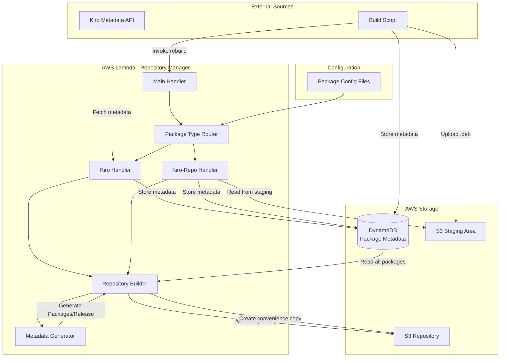

# Design Document: Unified Multi-Package Repository

## Overview

This design transforms the existing single-package Debian repository manager into a unified multi-package system where DynamoDB serves as the single source of truth for all packages (kiro, kiro-repo, kiro-cli). The key architectural innovation is that kiro-repo.deb becomes a proper Debian package in the repository that APT can automatically update, while also being available as a convenience copy at the repository root for initial setup.

The system supports multiple package types with different build workflows:
- **kiro**: External download from metadata endpoint (existing workflow)
- **kiro-repo**: Built by external script and uploaded to S3 staging area
- **kiro-cli**: Future support for additional build workflows

All package metadata is stored in DynamoDB with complete information needed to rebuild the entire repository without reading from S3. This enables force rebuild capabilities and ensures data consistency.

### Key Design Principles

1. **DynamoDB as Single Source of Truth**: All package metadata stored in DynamoDB with sufficient detail to regenerate repository metadata files
2. **Extensibility**: Plugin-based architecture for adding new package types
3. **Configuration-Driven**: Package definitions in version-controlled configuration files
4. **Idempotent Operations**: Force rebuild produces identical output given same DynamoDB state
5. **Separation of Concerns**: Clear boundaries between package acquisition, metadata management, and repository publishing

## Architecture

### High-Level Architecture



### Component Architecture

The system is organized into the following major components:

1. **Lambda Handler** (`main.py`): Entry point, orchestrates workflow, handles force rebuild flag
2. **Package Type Router** (`package_router.py`): Routes package processing to appropriate handler based on configuration
3. **Package Handlers**: Type-specific logic for acquiring and processing packages
   - `KiroPackageHandler`: Fetches from external metadata endpoint
   - `KiroRepoPackageHandler`: Reads from S3 staging area
   - Future: `KiroCliPackageHandler`
4. **Version Manager** (`version_manager.py`): DynamoDB operations for package metadata
5. **Repository Builder** (`repository_builder.py`): Generates repository structure and metadata files
6. **S3 Publisher** (`s3_publisher.py`): Uploads repository files with proper organization
7. **Configuration Manager** (`config_manager.py`): Loads and validates package configuration files

### Data Flow

#### Normal Workflow (New Package Version)

1. Lambda triggered by schedule or manual invocation
2. For each package type in configuration:
   - Check if new version available (via handler)
   - If new version found and not in DynamoDB:
     - Download/acquire package
     - Extract metadata
     - Store complete metadata in DynamoDB
3. Retrieve all packages from DynamoDB
4. Generate repository metadata (Packages, Release files)
5. Upload to S3:
   - Package files to pool directories
   - Metadata files to dists directory
   - Convenience copy of kiro-repo.deb to root
   - Instructions page to root

#### Force Rebuild Workflow

1. Lambda invoked with `force_rebuild: true` flag
2. Skip version checking and package acquisition
3. Retrieve all packages from DynamoDB
4. Generate repository metadata from DynamoDB data only
5. Upload metadata files to S3 (package files already in S3)
6. Update convenience copy of kiro-repo.deb

#### Build Script Workflow (kiro-repo)

1. Developer runs build script with version parameter
2. Script reads Terraform state for resource names
3. Script builds kiro-repo.deb package
4. Script uploads .deb to S3 staging area
5. Script computes checksums and metadata
6. Script stores complete metadata in DynamoDB
7. Script invokes Lambda with force_rebuild flag
8. Lambda rebuilds repository including new kiro-repo version

## Components and Interfaces

### DynamoDB Schema

The DynamoDB table uses a composite key structure to support multiple package types.

#### Table Configuration

```
Table Name: kiro-debian-repo-manager-versions-{env}
Partition Key: package_id (String) - Format: "{package_name}#{version}"
Billing Mode: PAY_PER_REQUEST
Encryption: Server-side encryption enabled
Point-in-time Recovery: Enabled
```

#### Attribute Schema

```python
{
    # Primary Key
    "package_id": str,  # "{package_name}#{version}" e.g., "kiro#1.2.3", "kiro-repo#1.0"
    
    # Package Identity
    "package_name": str,  # "kiro", "kiro-repo", "kiro-cli"
    "version": str,  # Semantic version string
    "architecture": str,  # "amd64", "all"
    
    # Debian Control Fields
    "section": str,  # "editors", "misc", etc.
    "priority": str,  # "optional", "required", etc.
    "maintainer": str,  # "Kiro Team <support@kiro.dev>"
    "homepage": str,  # "https://kiro.dev"
    "description": str,  # Package description
    "depends": str | None,  # Dependency string (optional)
    
    # File Metadata
    "deb_url": str,  # Original download URL or S3 staging URL
    "actual_filename": str,  # Actual .deb filename
    "file_size": int,  # File size in bytes
    "md5_hash": str,  # MD5 checksum
    "sha1_hash": str,  # SHA1 checksum
    "sha256_hash": str,  # SHA256 checksum
    
    # Package-Specific Fields (optional)
    "certificate_url": str | None,  # For kiro packages only
    "signature_url": str | None,  # For kiro packages only
    "notes": str | None,  # Release notes
    
    # Metadata
    "pub_date": str,  # Publication date (ISO format)
    "processed_timestamp": str,  # When processed by system (ISO format)
    "package_type": str,  # "external_download", "build_script", etc.
}
```

#### Query Patterns

```python
# Get all packages (for repository rebuild)
response = table.scan()

# Get all versions of a specific package
response = table.scan(
    FilterExpression="package_name = :pkg_name",
    ExpressionAttributeValues={":pkg_name": "kiro-repo"}
)

# Check if specific version exists
response = table.get_item(
    Key={"package_id": "kiro-repo#1.0"}
)

# Get latest version (application-level sorting after scan)
packages = table.scan(FilterExpression="package_name = :pkg_name")
latest = max(packages, key=lambda p: parse_version(p["version"]))
```

### Package Configuration Files

Configuration files define package characteristics and build parameters. Located in `config/packages/`.

#### Configuration File Format (YAML)

```yaml
# config/packages/kiro.yaml
package_name: kiro
description: "Kiro IDE - AI-powered development environment"
maintainer: "Kiro Team <support@kiro.dev>"
homepage: "https://kiro.dev"
section: editors
priority: optional
architecture: amd64

# Source configuration
source:
  type: external_download
  metadata_endpoint: "https://download.kiro.dev/linux/metadata.json"
  
# Additional files to download (optional)
additional_files:
  - certificate
  - signature
```

```yaml
# config/packages/kiro-repo.yaml
package_name: kiro-repo
description: "Kiro IDE Repository Configuration"
maintainer: "Kiro Team <support@kiro.dev>"
homepage: "https://kiro.dev"
section: misc
priority: optional
architecture: all

# Source configuration
source:
  type: build_script
  staging_prefix: "staging/kiro-repo/"
  
# Build script configuration (for documentation)
build:
  script_path: "scripts/build-kiro-repo.sh"
  template_dir: "templates/kiro-repo/"
```

```yaml
# config/packages/kiro-cli.yaml (future)
package_name: kiro-cli
description: "Kiro CLI - Command-line tools for Kiro IDE"
maintainer: "Kiro Team <support@kiro.dev>"
homepage: "https://kiro.dev"
section: devel
priority: optional
architecture: amd64
depends: "kiro (>= 1.0)"

# Source configuration
source:
  type: github_release
  repository: "kiro-dev/kiro-cli"
  asset_pattern: "kiro-cli_*_amd64.deb"
```

### Configuration Manager

```python
# src/config_manager.py

from dataclasses import dataclass
from pathlib import Path
from typing import Any
import yaml

@dataclass
class SourceConfig:
    """Configuration for package source."""
    type: str  # "external_download", "build_script", "github_release"
    metadata_endpoint: str | None = None
    staging_prefix: str | None = None
    repository: str | None = None
    asset_pattern: str | None = None

@dataclass
class PackageConfig:
    """Configuration for a package type."""
    package_name: str
    description: str
    maintainer: str
    homepage: str
    section: str
    priority: str
    architecture: str
    depends: str | None
    source: SourceConfig
    
    @classmethod
    def from_yaml(cls, yaml_path: Path) -> "PackageConfig":
        """Load configuration from YAML file."""
        with open(yaml_path) as f:
            data = yaml.safe_load(f)
        
        source_data = data["source"]
        source = SourceConfig(
            type=source_data["type"],
            metadata_endpoint=source_data.get("metadata_endpoint"),
            staging_prefix=source_data.get("staging_prefix"),
            repository=source_data.get("repository"),
            asset_pattern=source_data.get("asset_pattern"),
        )
        
        return cls(
            package_name=data["package_name"],
            description=data["description"],
            maintainer=data["maintainer"],
            homepage=data["homepage"],
            section=data["section"],
            priority=data["priority"],
            architecture=data["architecture"],
            depends=data.get("depends"),
            source=source,
        )

class ConfigManager:
    """Manages package configuration files."""
    
    def __init__(self, config_dir: str = "config/packages"):
        self.config_dir = Path(config_dir)
    
    def load_all_configs(self) -> list[PackageConfig]:
        """Load all package configurations."""
        configs = []
        for yaml_file in self.config_dir.glob("*.yaml"):
            config = PackageConfig.from_yaml(yaml_file)
            configs.append(config)
        return configs
    
    def get_config(self, package_name: str) -> PackageConfig:
        """Get configuration for specific package."""
        yaml_path = self.config_dir / f"{package_name}.yaml"
        return PackageConfig.from_yaml(yaml_path)
```

### Package Handler Interface

```python
# src/package_handlers/base.py

from abc import ABC, abstractmethod
from typing import Optional
from src.models import PackageMetadata

class PackageHandler(ABC):
    """Base class for package type handlers."""
    
    def __init__(self, config: PackageConfig):
        self.config = config
    
    @abstractmethod
    def check_new_version(self) -> Optional[str]:
        """Check if new version is available.
        
        Returns:
            Version string if new version available, None otherwise
        """
        pass
    
    @abstractmethod
    def acquire_package(self, version: str) -> PackageMetadata:
        """Acquire package and return complete metadata.
        
        Args:
            version: Version to acquire
            
        Returns:
            PackageMetadata with all fields populated
        """
        pass
    
    @abstractmethod
    def get_package_file_path(self, metadata: PackageMetadata) -> str:
        """Get local file path for package.
        
        Args:
            metadata: Package metadata
            
        Returns:
            Local file path to .deb file
        """
        pass
```

### Kiro Package Handler

```python
# src/package_handlers/kiro_handler.py

class KiroPackageHandler(PackageHandler):
    """Handler for kiro packages from external metadata endpoint."""
    
    def __init__(self, config: PackageConfig):
        super().__init__(config)
        self.metadata_client = MetadataClient(
            endpoint=config.source.metadata_endpoint
        )
        self.downloader = PackageDownloader()
    
    def check_new_version(self) -> Optional[str]:
        """Check metadata endpoint for new version."""
        current_release = self.metadata_client.get_current_release()
        return current_release.version
    
    def acquire_package(self, version: str) -> PackageMetadata:
        """Download package and extract metadata."""
        release_info = self.metadata_client.get_current_release()
        local_files = self.downloader.download_release_files(release_info)
        self.downloader.verify_package_integrity(local_files)
        
        # Populate file metadata
        self.downloader.populate_file_metadata(release_info, local_files)
        
        # Convert to PackageMetadata
        return PackageMetadata(
            package_name=self.config.package_name,
            version=release_info.version,
            architecture=self.config.architecture,
            pub_date=release_info.pub_date,
            deb_url=release_info.deb_url,
            actual_filename=release_info.actual_filename,
            file_size=release_info.file_size,
            md5_hash=release_info.md5_hash,
            sha1_hash=release_info.sha1_hash,
            sha256_hash=release_info.sha256_hash,
            certificate_url=release_info.certificate_url,
            signature_url=release_info.signature_url,
            notes=release_info.notes,
            section=self.config.section,
            priority=self.config.priority,
            maintainer=self.config.maintainer,
            homepage=self.config.homepage,
            description=self.config.description,
        )
    
    def get_package_file_path(self, metadata: PackageMetadata) -> str:
        """Return path to downloaded .deb file."""
        return f"/tmp/{metadata.actual_filename}"
```

### Kiro-Repo Package Handler

```python
# src/package_handlers/kiro_repo_handler.py

class KiroRepoPackageHandler(PackageHandler):
    """Handler for kiro-repo packages from S3 staging area."""
    
    def __init__(self, config: PackageConfig):
        super().__init__(config)
        self.s3_client = boto3.client("s3")
        self.bucket_name = get_env_var(ENV_S3_BUCKET, required=True)
    
    def check_new_version(self) -> Optional[str]:
        """Check S3 staging area for new package.
        
        Build script stores metadata in DynamoDB, so we check there
        for versions not yet in the repository.
        """
        # This handler is typically triggered by force_rebuild
        # after build script stores metadata
        return None
    
    def acquire_package(self, version: str) -> PackageMetadata:
        """Read package metadata from DynamoDB (already stored by build script)."""
        # Build script already stored complete metadata
        # This method is not typically called for kiro-repo
        raise NotImplementedError(
            "kiro-repo packages are stored by build script"
        )
    
    def get_package_file_path(self, metadata: PackageMetadata) -> str:
        """Download from S3 staging area if needed."""
        staging_key = f"{self.config.source.staging_prefix}{metadata.actual_filename}"
        local_path = f"/tmp/{metadata.actual_filename}"
        
        self.s3_client.download_file(
            self.bucket_name,
            staging_key,
            local_path
        )
        
        return local_path
```

### Package Router

```python
# src/package_router.py

class PackageRouter:
    """Routes package processing to appropriate handler."""
    
    def __init__(self):
        self.config_manager = ConfigManager()
        self.version_manager = VersionManager()
        self.handlers: dict[str, PackageHandler] = {}
        
        # Load configurations and create handlers
        for config in self.config_manager.load_all_configs():
            handler = self._create_handler(config)
            self.handlers[config.package_name] = handler
    
    def _create_handler(self, config: PackageConfig) -> PackageHandler:
        """Create appropriate handler based on source type."""
        if config.source.type == "external_download":
            return KiroPackageHandler(config)
        elif config.source.type == "build_script":
            return KiroRepoPackageHandler(config)
        elif config.source.type == "github_release":
            return GitHubReleaseHandler(config)
        else:
            raise ValueError(f"Unknown source type: {config.source.type}")
    
    def process_all_packages(self, force_rebuild: bool = False) -> list[PackageMetadata]:
        """Process all configured packages.
        
        Args:
            force_rebuild: If True, skip version checking
            
        Returns:
            List of newly processed packages
        """
        new_packages = []
        
        if force_rebuild:
            logger.info("Force rebuild - skipping version checks")
            return new_packages
        
        for package_name, handler in self.handlers.items():
            try:
                # Check for new version
                new_version = handler.check_new_version()
                
                if new_version is None:
                    continue
                
                # Check if already processed
                if self.version_manager.is_package_version_processed(
                    package_name, new_version
                ):
                    logger.info(
                        f"{package_name} {new_version} already processed"
                    )
                    continue
                
                # Acquire and process package
                logger.info(f"Processing {package_name} {new_version}")
                metadata = handler.acquire_package(new_version)
                
                # Store in DynamoDB
                self.version_manager.store_package_metadata(metadata)
                new_packages.append(metadata)
                
            except Exception as e:
                logger.error(f"Failed to process {package_name}: {e}")
                # Continue with other packages
                continue
        
        return new_packages
```


### Updated Main Handler

```python
# src/main.py (updated)

def lambda_handler(event: dict[str, Any], context: Any) -> dict[str, Any]:
    """AWS Lambda handler function with multi-package support.
    
    Supports manual rebuild via event parameter:
    - force_rebuild: Set to true to rebuild repository from DynamoDB
    
    Args:
        event: Lambda event data
        context: Lambda context object
        
    Returns:
        Response dictionary with status and message
    """
    system_logger = setup_logging()
    logger = system_logger.logger
    operation_logger = system_logger.get_operation_logger()
    
    try:
        force_rebuild = event.get("force_rebuild", False)
        if force_rebuild:
            logger.info("Force rebuild requested")
        
        # System startup logging
        system_logger.log_system_start(
            lambda_request_id=getattr(context, "aws_request_id", "unknown"),
            function_name=getattr(context, "function_name", "unknown"),
            function_version=getattr(context, "function_version", "unknown"),
        )
        
        # Validate IAM and permissions
        operation_logger.start_operation("iam_validation")
        validate_iam_role_authentication()
        operation_logger.complete_operation("iam_validation", success=True)
        
        s3_bucket = get_env_var(ENV_S3_BUCKET, required=True)
        dynamodb_table = get_env_var(ENV_DYNAMODB_TABLE, required=True)
        region = get_env_var(ENV_AWS_REGION, "us-east-1")
        
        operation_logger.start_operation("permission_validation")
        permission_validator = AWSPermissionValidator(region)
        permission_validator.validate_all_permissions(s3_bucket, dynamodb_table)
        operation_logger.complete_operation("permission_validation", success=True)
        
        # Initialize components
        package_router = PackageRouter()
        version_manager = VersionManager(validate_permissions=False)
        repository_builder = RepositoryBuilder()
        s3_publisher = S3Publisher(validate_permissions=False)
        notification_service = NotificationService(validate_permissions=False)
        
        # Process packages (skip if force rebuild)
        new_packages = []
        if not force_rebuild:
            operation_logger.start_operation("package_processing")
            new_packages = package_router.process_all_packages(force_rebuild=False)
            operation_logger.complete_operation(
                "package_processing",
                success=True,
                new_packages_count=len(new_packages)
            )
            
            if not new_packages:
                logger.info("No new packages to process")
                system_logger.log_system_termination(success=True)
                return {
                    "statusCode": 200,
                    "body": "No new packages to process"
                }
        
        # Build repository from all packages in DynamoDB
        operation_logger.start_operation("repository_build")
        all_packages = version_manager.get_all_packages()
        
        # Create local files map for newly downloaded packages
        local_files_map = {}
        for pkg in new_packages:
            handler = package_router.handlers.get(pkg.package_name)
            if handler:
                local_path = handler.get_package_file_path(pkg)
                # Create LocalReleaseFiles for compatibility
                local_files_map[pkg.version] = LocalReleaseFiles(
                    deb_file_path=local_path,
                    certificate_path="",
                    signature_path="",
                    version=pkg.version
                )
        
        repository_structure = repository_builder.create_repository_structure(
            packages=all_packages,
            local_files_map=local_files_map,
            bucket_name=s3_bucket,
        )
        operation_logger.complete_operation(
            "repository_build",
            success=True,
            total_packages=len(all_packages)
        )
        
        # Upload to S3
        operation_logger.start_operation("s3_upload")
        s3_publisher.upload_repository(repository_structure)
        
        # Upload convenience copy of latest kiro-repo
        kiro_repo_packages = [p for p in all_packages if p.package_name == "kiro-repo"]
        if kiro_repo_packages:
            latest_kiro_repo = max(
                kiro_repo_packages,
                key=lambda p: parse_version(p.version)
            )
            s3_publisher.upload_convenience_copy(latest_kiro_repo)
        
        operation_logger.complete_operation("s3_upload", success=True)
        
        # Clean up downloaded files
        package_router.cleanup_downloads()
        
        # Send notifications for new packages
        if new_packages:
            for pkg in new_packages:
                notification_service.send_package_notification(pkg)
        
        # Log completion
        system_logger.increment_metric("operations_completed", 1)
        system_logger.set_metric("total_packages", len(all_packages))
        system_logger.log_system_termination(success=True)
        
        if force_rebuild:
            return {
                "statusCode": 200,
                "body": f"Successfully rebuilt repository with {len(all_packages)} packages"
            }
        else:
            return {
                "statusCode": 200,
                "body": f"Successfully processed {len(new_packages)} new packages"
            }
    
    except Exception as e:
        # Error handling
        try:
            notification_service = NotificationService(validate_permissions=False)
            notification_service.send_failure_notification(e, "Lambda execution")
        except Exception as notification_error:
            logger.error(f"Failed to send failure notification: {notification_error}")
        
        system_logger.increment_metric("operations_failed", 1)
        operation_logger.log_error("lambda_execution", e)
        system_logger.log_system_termination(success=False)
        
        return {
            "statusCode": 500,
            "body": f"Error processing repository: {str(e)}"
        }
```

### S3 Publisher Updates

```python
# src/s3_publisher.py (additions)

class S3Publisher:
    """Publishes repository files to S3."""
    
    # ... existing methods ...
    
    def upload_convenience_copy(self, kiro_repo_metadata: PackageMetadata) -> None:
        """Upload convenience copy of kiro-repo.deb to repository root.
        
        Args:
            kiro_repo_metadata: Metadata for latest kiro-repo package
        """
        logger.info(
            f"Uploading convenience copy of kiro-repo {kiro_repo_metadata.version}"
        )
        
        # Source: pool directory
        pool_key = (
            f"pool/main/k/kiro-repo/{kiro_repo_metadata.actual_filename}"
        )
        
        # Destination: repository root
        convenience_key = "kiro-repo.deb"
        
        try:
            # Copy within S3 (no download/upload needed)
            self.s3_client.copy_object(
                Bucket=self.bucket_name,
                CopySource={"Bucket": self.bucket_name, "Key": pool_key},
                Key=convenience_key,
                ACL="public-read",
                ContentType="application/vnd.debian.binary-package",
                MetadataDirective="REPLACE",
                Metadata={
                    "version": kiro_repo_metadata.version,
                    "package": "kiro-repo",
                }
            )
            
            logger.info(
                f"Uploaded convenience copy: {convenience_key} "
                f"(version {kiro_repo_metadata.version})"
            )
            
        except ClientError as e:
            logger.error(f"Failed to upload convenience copy: {e}")
            raise
```

## Data Models

### Updated PackageMetadata Model

The existing `PackageMetadata` model in `src/models.py` already supports multi-package functionality. No changes needed, but here's the complete model for reference:

```python
@dataclass
class PackageMetadata:
    """Metadata for a package in the repository (multi-package support)."""
    
    package_name: str  # "kiro", "kiro-repo", "kiro-cli"
    version: str
    architecture: str  # "amd64", "all"
    pub_date: str
    
    # File information
    deb_url: str
    actual_filename: str
    file_size: int
    md5_hash: str
    sha1_hash: str
    sha256_hash: str
    
    # Optional fields
    certificate_url: str | None = None
    signature_url: str | None = None
    notes: str | None = None
    
    # Metadata
    processed_timestamp: datetime | None = None
    
    # Package-specific metadata
    section: str = "editors"
    priority: str = "optional"
    maintainer: str = "Kiro Team <support@kiro.dev>"
    homepage: str = "https://kiro.dev"
    description: str = ""
    depends: str | None = None
    
    @property
    def package_id(self) -> str:
        """Compute package_id from package_name and version."""
        return f"{self.package_name}#{version}"
```

### Version Parsing Utility

```python
# src/utils.py (new file)

from typing import Tuple

def parse_version(version: str) -> Tuple[int, ...]:
    """Parse semantic version string into tuple for comparison.
    
    Args:
        version: Version string (e.g., "1.2.3", "1.0")
        
    Returns:
        Tuple of integers for comparison
        
    Examples:
        >>> parse_version("1.2.3")
        (1, 2, 3)
        >>> parse_version("1.0") < parse_version("1.1")
        True
    """
    try:
        return tuple(int(x) for x in version.split("."))
    except (ValueError, AttributeError):
        # Fallback for non-standard versions
        return (0,)
```

## Correctness Properties

*A property is a characteristic or behavior that should hold true across all valid executions of a system—essentially, a formal statement about what the system should do. Properties serve as the bridge between human-readable specifications and machine-verifiable correctness guarantees.*

Based on the prework analysis and property reflection, here are the consolidated correctness properties:

### Property 1: Multi-Package Type Storage

*For any* set of packages with different package types (kiro, kiro-repo, kiro-cli), when stored in DynamoDB, all packages should be retrievable and correctly identified by their package type.

**Validates: Requirements 1.1, 4.1, 4.2, 17.3**

### Property 2: Package Metadata Completeness

*For any* package stored in DynamoDB, the package entry should contain all required fields: package_name, version, architecture, deb_url, actual_filename, file_size, md5_hash, sha1_hash, sha256_hash, section, priority, maintainer, homepage, description, pub_date, processed_timestamp, and package_type.

**Validates: Requirements 1.2, 1.3, 9.3, 9.4, 9.5**

### Property 3: Force Rebuild Retrieves All Packages

*For any* DynamoDB state containing N packages, when force rebuild is invoked, the system should retrieve exactly N packages from DynamoDB.

**Validates: Requirements 1.4, 7.2**

### Property 4: Repository Metadata Generation from DynamoDB Alone

*For any* set of packages in DynamoDB with complete metadata, the system should be able to generate valid Packages and Release files without reading package files from S3.

**Validates: Requirements 1.5, 9.6**

### Property 5: Package Query by Name

*For any* package name and set of packages in DynamoDB, querying by package name should return only packages with that exact package_name value.

**Validates: Requirements 1.6**

### Property 6: Latest Version Identification

*For any* set of packages with the same package_name, the system should correctly identify the package with the highest semantic version as the latest.

**Validates: Requirements 1.7**

### Property 7: Pool Directory Structure

*For any* package with package_name P, the pool directory path should be `pool/main/{first_letter_of_P}/{P}/` where first_letter_of_P is the first character of the package name.

**Validates: Requirements 2.1, 2.5, 4.4, 11.1**

### Property 8: Packages File Entry Completeness

*For any* package in the repository, its entry in the Packages file should contain all required Debian fields: Package, Version, Architecture, Maintainer, Section, Priority, Homepage, Description, Filename, Size, MD5sum, SHA1, SHA256.

**Validates: Requirements 2.2, 2.6, 10.2**

### Property 9: All Packages Included in Packages File

*For any* set of packages in DynamoDB, when generating the Packages file, all packages should have corresponding entries in the file.

**Validates: Requirements 4.3, 10.1**

### Property 10: Convenience Copy Points to Latest Version

*For any* set of kiro-repo packages in the repository, the convenience copy at the repository root should have the same checksum as the package with the highest version number in the pool directory.

**Validates: Requirements 3.1, 3.3, 3.5**

### Property 11: Convenience Copy Location

*For any* repository build that includes kiro-repo packages, the convenience copy should be located at the S3 key "kiro-repo.deb" (repository root).

**Validates: Requirements 3.2, 11.4**

### Property 12: Convenience Copy is Regular Object

*For any* convenience copy uploaded to S3, the S3 object should be a regular object (not a redirect or symbolic link), verifiable by checking that the object has actual content and a valid ETag.

**Validates: Requirements 3.4**

### Property 13: Release File Contains Packages Checksums

*For any* Packages file content, the Release file should contain MD5, SHA1, and SHA256 checksums that match the actual checksums of the Packages file content.

**Validates: Requirements 10.3**

### Property 14: Release File Metadata Completeness

*For any* Release file, it should contain all required fields: Origin, Label, Suite, Codename, Version, Architectures, Components, Description, Date, Valid-Until, and checksum entries for Packages file.

**Validates: Requirements 10.4**

### Property 15: S3 Upload Path Correctness

*For any* file uploaded to S3, the S3 key should match the expected path based on file type: Packages files in `dists/stable/main/binary-amd64/`, Release files in `dists/stable/`, package files in `pool/main/{first-letter}/{package-name}/`, and index.html at root.

**Validates: Requirements 11.2, 11.3, 11.5**

### Property 16: Content-Type Headers

*For any* file uploaded to S3, the Content-Type header should match the file type: "application/vnd.debian.binary-package" for .deb files, "text/plain" for Packages and Release files, "text/html" for index.html.

**Validates: Requirements 11.6**

### Property 17: Public Read Permissions

*For any* file uploaded to S3 by the repository manager, the S3 object should have public-read ACL, verifiable by checking the object's ACL grants.

**Validates: Requirements 11.7**

### Property 18: Version Deduplication

*For any* package with package_name P and version V, if a package entry with package_id "P#V" already exists in DynamoDB, the system should skip processing that version and not download or store it again.

**Validates: Requirements 18.2**

### Property 19: Semantic Version Comparison

*For any* two version strings V1 and V2, the version comparison should follow semantic versioning rules where "1.2.3" < "1.2.4" and "1.9.0" < "1.10.0".

**Validates: Requirements 12.5, 18.5**

### Property 20: Configuration File Completeness

*For any* package configuration file, it should contain all required fields: package_name, description, maintainer, homepage, section, priority, architecture, and source configuration with type field.

**Validates: Requirements 6.2, 6.3**

### Property 21: Configuration File Format

*For any* package configuration file in the config/packages/ directory, it should be valid YAML that can be parsed without errors.

**Validates: Requirements 6.6**

### Property 22: Package Type Agnostic Metadata Generation

*For any* package with complete metadata (regardless of package_name value), the system should be able to generate a valid Packages file entry with all required Debian fields.

**Validates: Requirements 17.5**


## Error Handling

### DynamoDB Error Handling

All DynamoDB operations implement retry logic with exponential backoff. The `VersionManager` class includes retry logic for all DynamoDB operations:

- Maximum 3 retry attempts
- Exponential backoff (2^attempt seconds)
- Detailed error logging with operation context
- Graceful degradation where possible

### S3 Error Handling

S3 operations include similar retry logic:

- Maximum 3 retry attempts for uploads and downloads
- Exponential backoff between retries
- Detailed error logging with S3 key and error code
- Failed uploads do not block other operations

### Package Handler Error Handling

The `PackageRouter` isolates errors to individual packages:

- Failure processing one package does not stop others
- Each package handler has try-catch wrapper
- Errors logged with package name and context
- System continues if at least one package succeeds
- Raises exception only if all packages fail

### Incomplete Metadata Handling

The system validates metadata completeness before processing:

- Required fields checked before storing in DynamoDB
- Packages with missing fields are skipped with warning log
- Log message includes which fields are missing
- Repository build continues with valid packages only

### Build Script Error Handling

The build script uses bash `set -e` for fail-fast behavior:

- Any command failure stops execution
- Clear error messages with context
- Non-zero exit codes for all error conditions
- Terraform state validation before proceeding
- AWS operation failures logged and exit immediately


## Testing Strategy

### Dual Testing Approach

The system uses both unit tests and property-based tests:

- **Unit Tests**: Specific examples, edge cases, error conditions, integration points
- **Property Tests**: Universal properties across randomized inputs (minimum 100 iterations each)

This ensures both concrete correctness (unit tests catch specific bugs) and general correctness (property tests verify invariants).

### Property-Based Testing Configuration

All property tests configured with:
- Minimum 100 iterations per test
- Hypothesis library for input generation
- Each test references design document property number
- Tag format: `Feature: unified-multi-package-repo, Property N: <property text>`

### Test Coverage Goals

- Unit test coverage: >80% of code lines
- Property tests: All 24 correctness properties implemented
- Integration tests: All major workflows (normal processing, force rebuild, build script, APT compatibility)
- Edge cases: Empty inputs, missing fields, network failures, permission errors

### Testing Tools

- pytest: Test framework
- hypothesis: Property-based testing
- moto: AWS service mocking
- responses: HTTP mocking
- pytest-cov: Coverage reporting


## Deployment and Migration

### Phase 1: Code Deployment (No Infrastructure Changes)

1. Add PyYAML dependency to pyproject.toml
2. Create package configuration files in config/packages/
3. Add new source modules (config_manager, package_router, handlers, utils)
4. Update main.py with new orchestration logic
5. Deploy to dev environment
6. Verify existing kiro packages still work

### Phase 2: kiro-repo Integration

1. Test build script in dev environment
2. Build and upload first kiro-repo package
3. Verify kiro-repo appears in repository
4. Test convenience copy at repository root
5. Verify APT can see and install kiro-repo

### Phase 3: Production Rollout

1. Deploy code to production
2. Build kiro-repo for production
3. Update documentation
4. Monitor for issues

### One-Time Migration Script

The migration script transforms existing DynamoDB records from the old schema (using `version` as partition key) to the new schema (using `package_id` as composite key). This is a one-time operation that eliminates the need for backward compatibility code in the main application.

#### Script Purpose

- Convert old schema records to new schema format
- Add missing metadata fields required by new schema
- Preserve all existing data with complete backup
- Provide safe dry-run mode for verification
- Enable clean cutover without downtime

#### Command-Line Interface

```bash
# Dry-run mode (shows transformations without modifying DynamoDB)
python scripts/migrate_dynamodb_schema.py --env dev --dry-run

# Actual migration with backup
python scripts/migrate_dynamodb_schema.py --env dev --backup-file backup-dev-$(date +%Y%m%d-%H%M%S).jsonl

# Production migration
python scripts/migrate_dynamodb_schema.py --env prod --backup-file backup-prod-$(date +%Y%m%d-%H%M%S).jsonl
```

**Options:**
- `--env`: Environment name (dev, staging, prod) - determines which DynamoDB table to migrate
- `--dry-run`: Show transformations without modifying DynamoDB
- `--backup-file`: Path to backup file (required for actual migration, optional for dry-run)

#### Migration Workflow

The script follows a safe, multi-step process:

1. **Backup Phase**
   - Scan all existing records from DynamoDB
   - Export to JSONL file with timestamp
   - Verify backup file is written successfully
   - Log count of records backed up

2. **Transform Phase**
   - Load package configuration files for metadata defaults
   - For each old record:
     - Create new `package_id` field: `"{package_name}#{version}"`
     - Add `package_name` field (default: "kiro" for old records)
     - Add `architecture` field (default: "amd64")
     - Add Debian metadata fields from config: `section`, `priority`, `maintainer`, `homepage`, `description`
     - Add `package_type` field (default: "external_download")
     - Preserve all existing fields: `version`, `deb_url`, `actual_filename`, `file_size`, checksums, timestamps
   - Validate each transformed record has all required fields
   - Log transformation details in dry-run mode

3. **Upload Phase** (skipped in dry-run)
   - Write each transformed record to DynamoDB with new schema
   - Use batch write operations for efficiency
   - Verify each write succeeds before proceeding
   - Log progress every 10 records

4. **Cleanup Phase** (skipped in dry-run)
   - After all new records successfully uploaded
   - Delete old schema records (identified by having `version` as partition key but no `package_id`)
   - Use batch delete operations
   - Verify deletions succeed
   - Log count of records deleted

#### Transformation Logic

```python
def transform_old_record_to_new(old_record: dict, config: PackageConfig) -> dict:
    """Transform old schema record to new schema.
    
    Old schema:
        - Partition key: version (string)
        - Attributes: deb_url, actual_filename, file_size, checksums, timestamps
        
    New schema:
        - Partition key: package_id (string) = "{package_name}#{version}"
        - Attributes: All old fields PLUS package_name, architecture, section,
                     priority, maintainer, homepage, description, package_type
    """
    # Extract version from old partition key
    version = old_record["version"]
    
    # Determine package name (default to "kiro" for old records)
    package_name = old_record.get("package_name", "kiro")
    
    # Create new composite key
    package_id = f"{package_name}#{version}"
    
    # Build new record with all fields
    new_record = {
        # New primary key
        "package_id": package_id,
        
        # Package identity (new fields)
        "package_name": package_name,
        "architecture": old_record.get("architecture", "amd64"),
        
        # Debian metadata (from config)
        "section": config.section,
        "priority": config.priority,
        "maintainer": config.maintainer,
        "homepage": config.homepage,
        "description": config.description,
        "depends": config.depends,
        
        # Package type (new field)
        "package_type": old_record.get("package_type", "external_download"),
        
        # Preserve all existing fields
        "version": version,
        "deb_url": old_record["deb_url"],
        "actual_filename": old_record["actual_filename"],
        "file_size": old_record["file_size"],
        "md5_hash": old_record["md5_hash"],
        "sha1_hash": old_record["sha1_hash"],
        "sha256_hash": old_record["sha256_hash"],
        "pub_date": old_record["pub_date"],
        "processed_timestamp": old_record["processed_timestamp"],
        
        # Optional fields (preserve if present)
        "certificate_url": old_record.get("certificate_url"),
        "signature_url": old_record.get("signature_url"),
        "notes": old_record.get("notes"),
    }
    
    # Remove None values
    return {k: v for k, v in new_record.items() if v is not None}
```

#### Error Handling and Rollback

**Error Scenarios:**

1. **Backup Failure**: Script exits immediately, no changes made
2. **Transformation Validation Failure**: Script exits, backup preserved, no DynamoDB changes
3. **Upload Failure**: Script stops, backup preserved, partial new records in DynamoDB
4. **Cleanup Failure**: Script stops, backup preserved, both old and new records in DynamoDB

**Rollback Strategy:**

If migration fails or needs to be rolled back:

1. **Restore from Backup**:
   ```bash
   python scripts/restore_from_backup.py --backup-file backup-dev-20240115-143022.jsonl --env dev
   ```

2. **Manual Cleanup** (if needed):
   - Delete new schema records: Query for records with `package_id` containing "#"
   - Verify old schema records still exist
   - Re-run migration after fixing issues

3. **Verification**:
   - Count records before and after
   - Verify all versions present in both schemas
   - Test Lambda function with mixed schema (if needed)

**Safety Features:**

- Dry-run mode shows exact transformations before execution
- Complete backup before any modifications
- Atomic operations where possible
- Detailed logging of every step
- Validation of transformed records before upload
- Preservation of backup file even after successful migration

#### Example Python Script Structure

```python
#!/usr/bin/env python3
"""
One-time migration script for DynamoDB schema transformation.

Transforms old schema (version as partition key) to new schema
(package_id as composite key with package_name#version format).
"""

import argparse
import json
import sys
from datetime import datetime
from pathlib import Path
from typing import Any

import boto3
from botocore.exceptions import ClientError

from src.config_manager import ConfigManager, PackageConfig


class DynamoDBSchemaMigration:
    """Handles one-time migration from old to new DynamoDB schema."""
    
    def __init__(self, env: str, dry_run: bool = False):
        self.env = env
        self.dry_run = dry_run
        self.table_name = f"kiro-debian-repo-manager-versions-{env}"
        self.dynamodb = boto3.resource("dynamodb")
        self.table = self.dynamodb.Table(self.table_name)
        self.config_manager = ConfigManager()
        
    def run_migration(self, backup_file: Path | None = None) -> None:
        """Execute complete migration workflow."""
        print(f"Starting migration for environment: {self.env}")
        print(f"DynamoDB table: {self.table_name}")
        print(f"Dry-run mode: {self.dry_run}")
        
        # Phase 1: Backup
        old_records = self.backup_existing_records(backup_file)
        print(f"Backed up {len(old_records)} records")
        
        # Phase 2: Transform
        config = self.config_manager.get_config("kiro")
        new_records = self.transform_records(old_records, config)
        print(f"Transformed {len(new_records)} records")
        
        if self.dry_run:
            self.display_sample_transformations(old_records[:3], new_records[:3])
            print("\nDry-run complete. No changes made to DynamoDB.")
            return
        
        # Phase 3: Upload
        self.upload_new_records(new_records)
        print(f"Uploaded {len(new_records)} new schema records")
        
        # Phase 4: Cleanup
        self.delete_old_records(old_records)
        print(f"Deleted {len(old_records)} old schema records")
        
        print("\nMigration complete!")
        print(f"Backup preserved at: {backup_file}")
    
    def backup_existing_records(self, backup_file: Path | None) -> list[dict]:
        """Scan and backup all existing records."""
        # Implementation details...
        pass
    
    def transform_records(
        self, old_records: list[dict], config: PackageConfig
    ) -> list[dict]:
        """Transform old schema records to new schema."""
        # Implementation details...
        pass
    
    def upload_new_records(self, new_records: list[dict]) -> None:
        """Upload transformed records to DynamoDB."""
        # Implementation details...
        pass
    
    def delete_old_records(self, old_records: list[dict]) -> None:
        """Delete old schema records after successful migration."""
        # Implementation details...
        pass
    
    def display_sample_transformations(
        self, old_samples: list[dict], new_samples: list[dict]
    ) -> None:
        """Display sample transformations for dry-run verification."""
        # Implementation details...
        pass


def main():
    parser = argparse.ArgumentParser(
        description="Migrate DynamoDB schema from old to new format"
    )
    parser.add_argument(
        "--env",
        required=True,
        choices=["dev", "staging", "prod"],
        help="Environment to migrate"
    )
    parser.add_argument(
        "--dry-run",
        action="store_true",
        help="Show transformations without modifying DynamoDB"
    )
    parser.add_argument(
        "--backup-file",
        type=Path,
        help="Path to backup file (required for actual migration)"
    )
    
    args = parser.parse_args()
    
    # Validate arguments
    if not args.dry_run and not args.backup_file:
        print("Error: --backup-file required for actual migration")
        sys.exit(1)
    
    # Run migration
    migration = DynamoDBSchemaMigration(args.env, args.dry_run)
    try:
        migration.run_migration(args.backup_file)
    except Exception as e:
        print(f"Migration failed: {e}")
        if args.backup_file:
            print(f"Backup preserved at: {args.backup_file}")
        sys.exit(1)


if __name__ == "__main__":
    main()
```

#### Usage Examples

**Dry-Run (Development)**:
```bash
# Preview transformations without making changes
python scripts/migrate_dynamodb_schema.py --env dev --dry-run

# Output:
# Starting migration for environment: dev
# DynamoDB table: kiro-debian-repo-manager-versions-dev
# Dry-run mode: True
# Backed up 15 records
# Transformed 15 records
#
# Sample Transformation 1:
# OLD: {"version": "1.2.3", "deb_url": "...", ...}
# NEW: {"package_id": "kiro#1.2.3", "package_name": "kiro", "version": "1.2.3", ...}
#
# Dry-run complete. No changes made to DynamoDB.
```

**Actual Migration (Development)**:
```bash
# Create backup and perform migration
python scripts/migrate_dynamodb_schema.py \
  --env dev \
  --backup-file backups/dev-migration-20240115-143022.jsonl

# Output:
# Starting migration for environment: dev
# DynamoDB table: kiro-debian-repo-manager-versions-dev
# Dry-run mode: False
# Backed up 15 records
# Transformed 15 records
# Uploading new records: 10/15...
# Uploaded 15 new schema records
# Deleting old records: 10/15...
# Deleted 15 old schema records
#
# Migration complete!
# Backup preserved at: backups/dev-migration-20240115-143022.jsonl
```

**Production Migration**:
```bash
# Always do dry-run first
python scripts/migrate_dynamodb_schema.py --env prod --dry-run

# Review output, then run actual migration
python scripts/migrate_dynamodb_schema.py \
  --env prod \
  --backup-file backups/prod-migration-$(date +%Y%m%d-%H%M%S).jsonl
```

#### Post-Migration Verification

After migration completes:

1. **Verify Record Count**:
   ```bash
   aws dynamodb scan --table-name kiro-debian-repo-manager-versions-dev \
     --select COUNT
   ```

2. **Verify New Schema**:
   ```bash
   aws dynamodb get-item \
     --table-name kiro-debian-repo-manager-versions-dev \
     --key '{"package_id": {"S": "kiro#1.2.3"}}'
   ```

3. **Test Lambda Function**:
   ```bash
   aws lambda invoke \
     --function-name kiro-debian-repo-manager-dev \
     --payload '{"force_rebuild": true}' \
     response.json
   ```

4. **Verify Repository**:
   ```bash
   curl https://repo.kiro.dev/dists/stable/main/binary-amd64/Packages
   ```

The migration script provides a safe, verifiable path to the new schema without requiring backward compatibility code in the main application.
